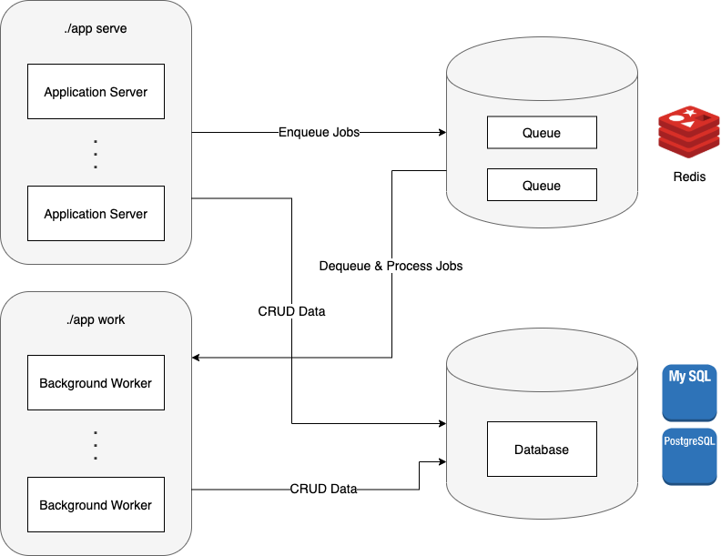
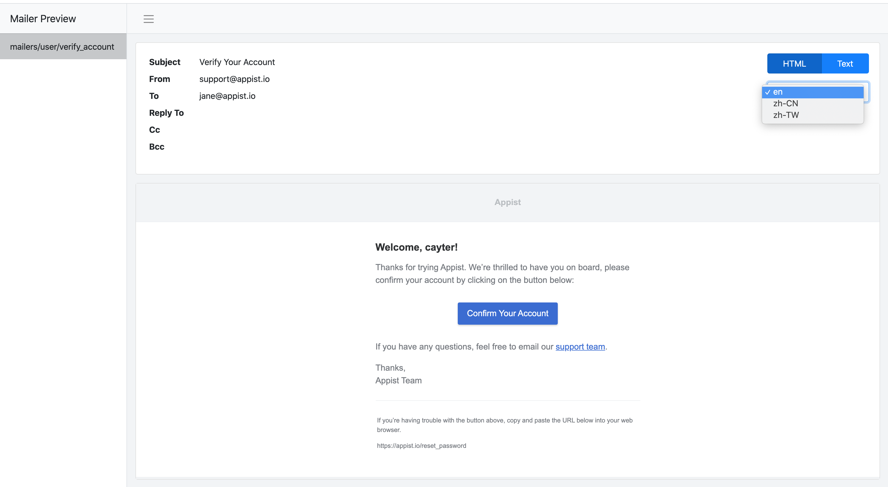

# appy

[](https://github.com/appist/appy/actions?workflow=Unit+Test)
[](https://github.com/appist/appy/actions?workflow=Vulnerabilities+Check)
[](https://goreportcard.com/report/github.com/appist/appy)
[](https://codecov.io/gh/appist/appy)
[](https://pkg.go.dev/github.com/appist/appy?tab=doc)
[](https://github.com/appist/appy)

An opinionated productive web framework that helps scaling business easier, i.e. focus on monolith first, only move to microservices with [GRPC](https://grpc.io/) later on when your team is ready.

<details>
  <summary>Click to see an application called "appist" made with "appy" in action</summary>

  <p align="center">
    &nbsp;&nbsp;&nbsp;&nbsp;
    
  </p>
</details>

#### Additional Notes

- `appy` is made as a package for your application to import without the need to install any additional binary
- `appy` comes with 2 build types:
  - debug - when the code is NOT running with the binary
  - release - when the code is running with the binary
- `appy` follows 12factor via `APPY_ENV` environment variable:
  - by default, it is `development`
  - when `APPY_ENV=staging` is set, the config file is `configs/.env.staging`
  - utilise `configs/.env.<APPY_ENV>` to support multiple environments deployment

## Table Of Contents

- [Overview](#overview)
- [Features](#features)
  - [package `cmd`](#package-cmd)
  - [package `mailer`](#package-mailer)
  - [package `pack`](#package-pack)
  - [package `record`](#package-record)
  - [package `view`](#package-view)
  - [package `worker`](#package-worker)
- [Getting Started](#getting-started)
- [Acknowledgement](#acknowledgement)
- [Contribution](#contribution)
- [License](#license)

## Overview

<p align="center">
  
</p>

## Features

### package `cmd`

- Powerful built-in commands
  <details>
    <summary>Click to see details</summary>

    ```bash
    My first awesome web application in Go.

    Usage:
      myapp [command]

    Available Commands:
      build             Compile the static assets into go files and build the release build binary (only available in debug build)
      config:dec        Decrypt a config value using the secret in `configs/<APPY_ENV>.key` or `APPY_MASTER_KEY` (only available in debug build)
      config:enc        Encrypt a config value using the secret in `configs/<APPY_ENV>.key` or `APPY_MASTER_KEY` (only available in debug build)
      db:create         Create all databases for the current environment
      db:drop           Drop all databases for the current environment
      db:migrate        Migrate the database(default: all, use --database to specify the target database) for the current environment
      db:migrate:status List all the database migration status(default: all, use --database to specify the target database) for the current environment
      db:rollback       Rollback the database(default: primary, use --database to specify the target database) to previous version for the current environment
      db:schema:dump    Dump all the databases schema for the current environment (only available in debug build)
      db:schema:load    Load all the databases schema for the current environment
      db:seed           Seed all databases for the current environment
      dc:down           Tear down the docker compose cluster
      dc:restart        Restart services that are defined in `.docker/docker-compose.yml`
      dc:up             Create and start containers that are defined in `.docker/docker-compose.yml`
      gen:migration     Generate database migration file(default: primary, use --database to specify the target database) for the current environment (only available in debug build)
      help              Help about any command
      middleware        List all the global middleware
      routes            List all the server-side routes
      secret            Generate a cryptographically secure secret key for encrypting cookie, CSRF token and config
      serve             Run the HTTP/HTTPS web server without `webpack-dev-server`
      setup             Run dc:up/db:create/db:schema:load/db:seed to setup the datastore with seed data
      ssl:setup         Generate and install the locally trusted SSL certs using `mkcert`
      ssl:teardown      Uninstall the locally trusted SSL certs using `mkcert`
      start             Run the HTTP/HTTPS web server with `webpack-dev-server` in development watch mode (only available in debug build)
      teardown          Tear down the docker compose cluster
      work              Run the worker to process background jobs

    Flags:
      -h, --help      help for myapp
      -v, --version   version for myapp

    Use "myapp [command] --help" for more information about a command.
    ```
  </details>

- Flexible custom commands building

### package `mailer`

- Ready-to-use SMTP email sending

- I18n support

- HTML templates binary embed support

- Developer friendly email preview UI
  <details>
    <summary>Click to see details</summary>

    <p align="center">
      
    </p>
  </details>

### package `pack`

- Powerful built-in HTTP middleware
  <details>
    <summary>Click to see details</summary>

    - API Only<br>
      Remove `Set-Cookie` response header if the `X-API-ONLY: 1` request header is sent.

    - CSRF<br>
      Protect cookies from `Cross-Site Request Forgery` by including/validating a token in the cookie across requests.

    - GZIP Compress<br>
      Compress the responses before returning it to the clients.

    - Health Check<br>
      Provide the HTTP GET endpoint for health check purpose.

    - I18n<br>
      Provide I18n support which the translations are stored in `<PROJECT_NAME>/pkg/locales/*.yml`.

    - Logger<br>
      Provide logger support.

    - Mailer<br>
      Provide mailer support which the views templates are stored in `<PROJECT_NAME>/pkg/views/mailers/**/*.{html,txt}`.

    - Prerender<br>
      Prerender and return the SPA page rendered by Chrome if the HTTP request is coming from the search engines.

    - Real IP<br>
      Retrieves the client's real IP address via `X-FORWARDED-FOR` or `X-REAL-IP` HTTP request header.

    - Recovery<br>
      Recover the HTTP request from panic and return 500 error page.

    - Request ID<br>
      Generate UUID v4 string for every HTTP request.

    - Request Logger<br>
      Log the HTTP request information.

    - Secure<br>
      Provide the standard HTTP security guards.

    - Session<br>
      Provide session management using cookie/redis.

    - SPA<br>
      Provide SPA hosting with specific path.

    - View Engine<br>
      Provide server-side HTML template rendering.
  </details>

- Ready-to-use test context builder for unit test

### package `record`

- Powerful database management commands
  <details>
    <summary>Click to see details</summary>

    ```bash
    db:create         Create all databases for the current environment
    db:drop           Drop all databases for the current environment
    db:migrate        Migrate the database(default: all, use --database to specify the target database) for the current environment
    db:migrate:status List all the database migration status(default: all, use --database to specify the target database) for the current environment
    db:rollback       Rollback the database(default: primary, use --database to specify the target database) to previous version for the current environment
    db:schema:dump    Dump all the databases schema for the current environment (only available in debug build)
    db:schema:load    Load all the databases schema for the current environment
    db:seed           Seed all databases for the current environment
    ```
  </details>

- Extended `sql.DB` with [sqlx](https://github.com/jmoiron/sqlx)

- Fully featured ORM
  <details>
    <summary>Click to see details</summary>

    - Master/Replica switch
    - Soft delete
    - Associations (Work In Progress)
      - Has One
      - Has Many
      - Belongs To
      - Many To Many
      - Polymorphism
      - Preload
      - Eager Load
    - Callbacks
      - BeforeValidate/AfterValidate
      - BeforeCreate/AfterCreate
      - BeforeDelete/AfterDelete
      - BeforeUpdate/AfterUpdate
      - BeforeCommit/AfterCreateCommit/AfterDeleteCommit/AfterUpdateCommit
      - BeforeRollback/AfterRollback
    - Composite primary keys
    - Execution with context
    - SQL query builder/logger/inspector
    - Transactions
    - Validations
  </details>

- Performant ORM
  <details>
    <summary>Click to see details</summary>

    ```bash
    go test -run=NONE -bench . -benchmem -benchtime 10s -failfast ./record
    goos: darwin
    goarch: amd64
    pkg: github.com/appist/appy/record
    BenchmarkInsertRaw-4                1239          10103533 ns/op              88 B/op          5 allocs/op
    BenchmarkInsertDB-4                  898          11351591 ns/op            1548 B/op         19 allocs/op
    BenchmarkInsertORM-4                 826          13826999 ns/op           15338 B/op        283 allocs/op
    BenchmarkInsertMultiRaw-4            529          21830643 ns/op          107896 B/op        415 allocs/op
    BenchmarkInsertMultiDB-4             481          20931749 ns/op          166302 B/op        441 allocs/op
    BenchmarkInsertMultiORM-4            471          23261618 ns/op          791677 B/op       3872 allocs/op
    BenchmarkUpdateRaw-4                 903          13807008 ns/op            1064 B/op         21 allocs/op
    BenchmarkUpdateDB-4                 1008          13577352 ns/op            3677 B/op         52 allocs/op
    BenchmarkUpdateORM-4                 788          13923442 ns/op            8920 B/op        233 allocs/op
    BenchmarkReadRaw-4                  2162           4723198 ns/op            1810 B/op         47 allocs/op
    BenchmarkReadDB-4                   2263           5300805 ns/op            3257 B/op         69 allocs/op
    BenchmarkReadORM-4                  2259           5184327 ns/op            6911 B/op        230 allocs/op
    BenchmarkReadSliceRaw-4             2210           5871991 ns/op           23088 B/op       1331 allocs/op
    BenchmarkReadSliceDB-4              2197           5752959 ns/op           25070 B/op       1353 allocs/op
    BenchmarkReadSliceORM-4             1864           6249231 ns/op          246630 B/op       1526 allocs/op
    PASS
    ok      github.com/appist/appy/record   344.692s
    ```
  </details>


- Ready-to-use DB/ORM mocks for unit test

### package `view`

- Performant and fully featured [template engine](https://github.com/CloudyKit/jet)

- I18n support

- HTML templates binary embed support

### package `worker`

- Fully featured background job processing backed by Redis
  <details>
    <summary>Click to see details</summary>

    - Cron jobs (Work In Progress)
    - Expiring jobs
    - Unique jobs
    - Scheduled jobs
    - Error handling
    - Middleware
    - Responsive Web UI + Authorization + Search (Work In Progress)
    - Strict/Weighted priority queues
  </details>

- Ready-to-use handler mock for unit test

## Getting Started

### Prerequisites

* [Docker w/ Docker Compose >= 19](https://www.docker.com/products/docker-desktop)
* [Go >= 1.14](https://golang.org/dl/)
* [NodeJS >= 14](https://nodejs.org/en/download/)
* [PostgreSQL >= 11](https://www.postgresql.org/download/)
* [MySQL >= 8](https://www.mysql.com/downloads/)

### Quick Start

#### Step 1: Create the project folder with go module and git initialised.

```bash
$ mkdir <PROJECT_NAME> && cd $_ && go mod init $_ && git init
```


> Note: The <PROJECT_NAME> must be an alphanumeric string.

#### Step 2: Create `main.go` with the snippet below.

```go
package main

import (
  "github.com/appist/appy/support"
)

func main() {
  support.Scaffold(support.ScaffoldOption{
    DBAdapter: "postgres", // only "mysql" and "postgres" are supported
    Description: "my first awesome app", // used in HTML's description meta tag, package.json and CLI help
  })
}
```

#### Step 3: Initialize the appy's project layout.

```bash
$ go run .
```

#### Step 4: Install project dependencies for backend and frontend.

```bash
$ go mod download
$ npm install
```

#### Step 5: Setup your local environment with databases running in docker compose cluster.

```bash
$ go run . setup
```

#### Step 6: Start developing your application locally.

```bash
$ go run . start
```

#### Step 7: Build the application binary with release mode.

```bash
$ go run . build
```

#### Step 8: Tear down everything once you're done.

```bash
$ go run . teardown
```

## Acknowledgement

- [asynq](https://github.com/hibiken/asynq) - For processing background jobs
- [cobra](https://github.com/spf13/cobra) - For building CLI
- [gin](https://github.com/gin-gonic/gin) - For building HTTP router
- [gqlgen](https://gqlgen.com/) - For building GraphQL API
- [sqlx](https://github.com/jmoiron/sqlx) - For interacting with MySQL/PostgreSQL
- [testify](https://github.com/stretchr/testify) - For writing unit tests
- [zap](https://github.com/uber-go/zap) - For blazing fast, structured and leveled logging

## Contribution

Please make sure to read the [Contributing Guide](https://github.com/appist/appy/blob/master/.github/CONTRIBUTING.md) before making a pull request.

Thank you to all the people who already contributed to appy!

## License

[MIT](http://opensource.org/licenses/MIT)

Copyright (c) 2019-present, Appist
