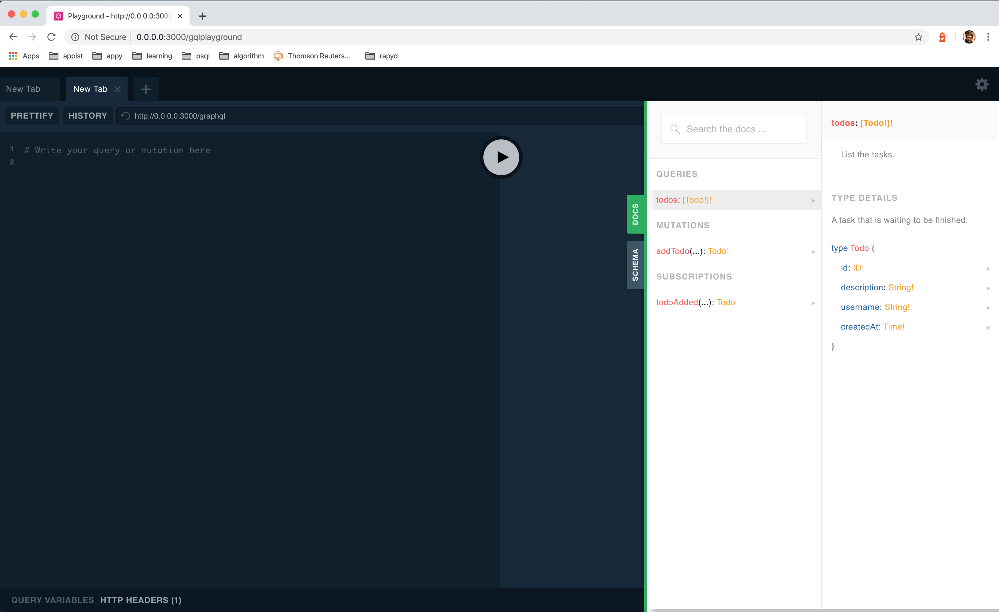

# Modifying Built-In Config

The framework comes with a bunch of built-in config that helps you setup the application easily. For example, we would like to change the path for GraphQL playground in `development` which by default is set to `/docs/graphql` , simply do:

```bash
// By default, `APPY_ENV` is "development".
$ go run . config:enc "/gqlplayground"

// Append the encrypted value. Note that this value is availabe in codebase as `app.Config.GQLPlaygroundPath`.
$ echo "GQL_PLAYGROUND_PATH=<ENCRYPTED_VALUE>" >> configs/.env.development

// Start the application development.
$ go run . start
```

And now you can open the GraphQL playground at [http://0.0.0.0:3000/gqlplayground](http://0.0.0.0:3000/gqlplayground) as shown in below:



For the full list of supported built-in config, please refer to the [documentation](https://pkg.go.dev/github.com/appist/appy?tab=doc#Config).

